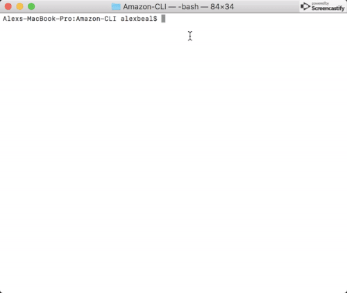
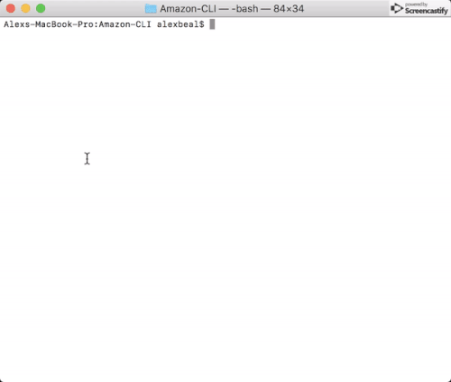

# Amazon-CLI

This is a command line interface storefront simulation

## Getting Started

Clone the directory and follow the instructions below

### Prerequisites

Node.js (v8 or >), MySQL Workbench, NPM

### Installing

1.) While in the repository directory, run the following command to install all dependencies.

```
npm install
```

2.) Update 'run.js', with your database login credentials.

```
const connection = mysql.createConnection({
    host: "localhost",
    port: 3306,
    user: "USER",
    password: "PASSWORD",
    database: "bamazon"
  });
  ```

  3.) Run 'bamazon.sql' in MySQL Workbench. This will create the database needed to run the application successfully.

## Running tests

Using node in the command line, you can run the following file.

### bamazonCustomer.js

This app will allow the user to:
* Select a product from a list.
* Select a quantity for the selected product.
* Finalize purchase and confirm your order

### Command

```
node bamazonCustomer.js
```

*Example: Product List/Quantity Selection/Order Confirmed*



*Example: Inventory Updates*



## Author

* [Alexander Beal](https://github.com/alexanderjbeal)
